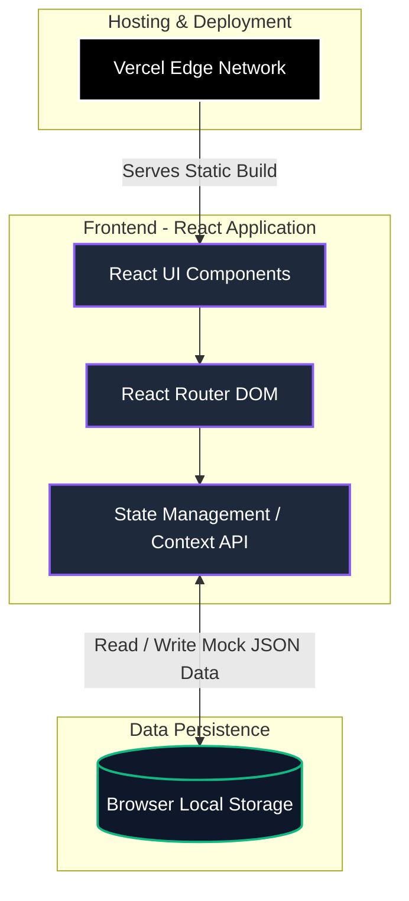

# ATOMQUEST HACKATHON 1.0 - Goal Setting & Tracking Portal

## 1. Live Hosted Demo URL
[https://goal-setting-and-tracking-portal-a8.vercel.app/login](https://goal-setting-and-tracking-portal-a8.vercel.app/login)

## 2. Source Code Repository
[https://github.com/kavishree546/goal-Setting-And-Tracking-Portal](https://github.com/kavishree546/goal-Setting-And-Tracking-Portal)

## 3. Login Credentials / User Journeys
The portal features a built-in role switcher on the login screen for demonstration purposes. No passwords are required for the demo. Simply click on the respective persona on the home page to log in:

* **Employee**: John Doe or Jane Smith
* **Manager (L1)**: Michael Scott
* **Admin / HR**: David Wallace

*Note: You can easily log out from the bottom of the sidebar to switch to another role and test the end-to-end workflow.*

## 4. Architecture Diagram
The application is built as a self-contained React application using Context API and LocalStorage for rapid prototyping, allowing the entire end-to-end flow to be demonstrated without external database dependencies.

*(Hackathon Judges: GitHub natively renders the Mermaid architecture diagram above. Alternatively, you can copy the code into [Mermaid Live](https://mermaid.live/) to export as a PDF/Image).*

---

## 🚀 Project Overview & Features In Detail

This Goal Setting & Tracking Portal was built specifically to solve the problem of fragmented goal-tracking methods (spreadsheets, emails) by providing a structured, digital, and intuitive platform. It supports the full lifecycle of employee goals—from creation and alignment to quarterly check-ins.

### 👥 Role-Based Access Control
The system features distinct dashboards and capabilities depending on the logged-in user:
* **Employees**: Can draft goals, submit for approval, and log quarterly achievements.
* **Managers (L1)**: Can review team goals, edit inline, approve, return for rework, and add structured feedback to check-ins.
* **Admins / HR**: Can push shared KPIs across departments, monitor organization-wide completion, and view audit trails.

### Phase 1: Goal Creation & Approval (Fully Implemented)

**Employee Goal Sheet:**
* **Comprehensive Goal Definition**: Employees select a Thrust Area (Financial, Customer, Process, Learning & Growth), Goal Title, Target, Unit of Measurement (UoM), and Weightage.
* **Strict Validation Rules**: The system mathematically enforces that an employee cannot submit their goals until the total weightage equals exactly **100%**. Individual goals must have a minimum weightage of **10%**, and employees are capped at a maximum of **8 goals**.

**Manager Approval Workflow:**
* Managers review submitted goals in their Inbox.
* **Inline Editing**: Managers can directly edit the Target or Weightage values of an employee's goal *before* approving, streamlining the negotiation process.
* **Return for Rework**: Managers can reject a goal and leave a required structured comment explaining what needs to be changed.
* **Lock Mechanism**: Once approved, goals are permanently locked and cannot be edited by the employee.

**Shared Goals (Admin Feature):**
* Admins can push a Departmental KPI to multiple employees simultaneously.
* These Shared Goals are auto-approved and appear on the employee's dashboard.
* Employees **cannot** edit the Goal Title or Target, but they **can** adjust the Weightage to ensure their total goals still equal 100%.

### Phase 2: Achievement Tracking & Quarterly Check-ins (Fully Implemented)

**Quarterly Update Interface:**
* Employees log their Actual Achievement against their Planned Targets.
* Employees can self-assess their status as *Not Started*, *On Track*, or *Completed*.

**Dynamic Progress Score Calculation:**
The system automatically calculates a Progress Score (%) based on the selected Unit of Measurement (UoM) formula:
* **Numeric (Min) / %**: *Achievement ÷ Target* (e.g., Sales Revenue - Higher is better).
* **Numeric (Max)**: *Target ÷ Achievement* (e.g., Turnaround Time - Lower is better).
* **Timeline**: Automatically evaluates the entered date against the deadline.
* **Zero-based**: Awards 100% if the actual is 0 (e.g., Safety incidents), otherwise 0%.

**Manager Check-in Review:**
* Managers view a side-by-side comparison of Planned vs. Actual data.
* Managers can submit a Structured Check-in Comment that remains visible to the employee on their dashboard.

### 📊 Reporting & Governance (Fully Implemented)
* **Completion Dashboard**: A real-time view for Admins showing exactly which employees have completed their Phase 1 Goal Setting and Phase 2 Check-ins.
* **Export to CSV**: Admins can instantly export the Completion Dashboard data to a CSV/Excel file for external reporting.
* **Audit Trail Logic**: Built-in views to establish the groundwork for tracking post-lock changes.

### 🎨 UI/UX & Design Architecture
* **Premium Glassmorphism Design**: The application discards generic styling for a highly polished, modern aesthetic using CSS variables, blurred glass panels, and vibrant gradient accents.
* **Fully Responsive**: Built to work flawlessly on monitors of all sizes.
* **No Backend Required for Demo**: Uses React Context API and Browser Local Storage. This architecture choice ensures zero database latency and flawless reliability during live hackathon demos.
