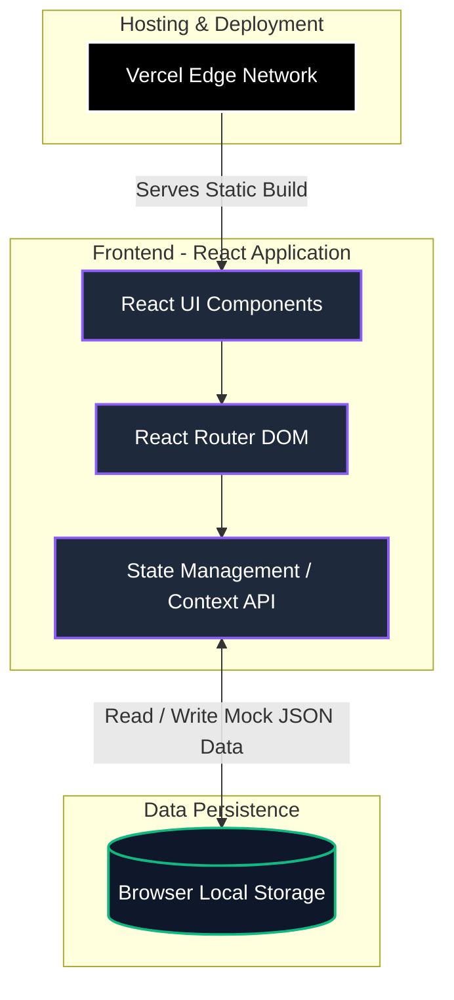

# ATOMQUEST HACKATHON 1.0 - Goal Setting & Tracking Portal

## 1. Live Hosted Demo URL
[https://goal-setting-and-tracking-portal-a8.vercel.app/login](https://goal-setting-and-tracking-portal-a8.vercel.app/login)

## 2. Source Code Repository
[https://github.com/kavishree546/goal-Setting-And-Tracking-Portal](https://github.com/kavishree546/goal-Setting-And-Tracking-Portal)

## 3. Login Credentials / User Journeys
The portal features a built-in role switcher on the login screen for demonstration purposes. No passwords are required for the demo. Simply click on the respective persona on the home page to log in:

* **Employee**: John Doe or Jane Smith
* **Manager (L1)**: Michael Scott
* **Admin / HR**: David Wallace

*Note: You can easily log out from the bottom of the sidebar to switch to another role and test the end-to-end workflow.*

## 4. Architecture Diagram
The application is built as a self-contained React application using Context API and LocalStorage for rapid prototyping, allowing the entire end-to-end flow to be demonstrated without external database dependencies.

*(Hackathon Judges: GitHub natively renders the Mermaid architecture diagram above).*

---

## Features Implemented
* **Phase 1 (Goal Setting)**: Employee goal creation, mathematical weightage validation (Must equal 100%, Min 10%, Max 8 Goals), Manager inline approvals/returns, and Admin Shared KPIs.
* **Phase 2 (Check-ins)**: Quarterly Check-ins, System-Computed Progress Scores based on UoM (Min, Max, Timeline, Zero-based).
* **Reporting & Governance**: Real-time Admin Completion Dashboard, Audit Log view, and CSV Data Export.
* **UI/UX**: Premium, fully responsive glassmorphism design with modern typography.
